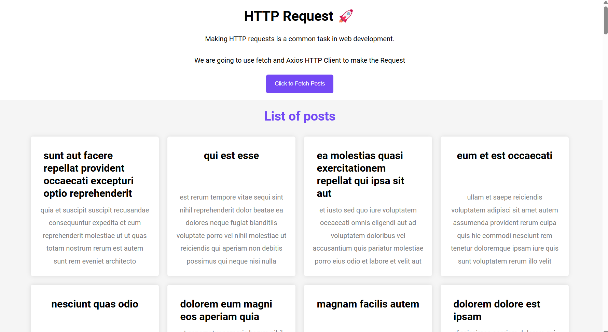

# Fetch API

This project utilizes the Fetch API in JavaScript to interact with an external API and retrieve data. The Fetch API provides a modern and streamlined approach to making asynchronous network requests, simplifying data fetching from web services.

Key Features:

Leverage the Fetch API for making HTTP requests (likely focusing on GET requests for this project).
Handle responses using Promises, ensuring proper asynchronous handling of data retrieval.
Parse the retrieved data (likely in JSON format) for further use within the application.
Potentially include functionalities like error handling and user interface updates based on the fetched data.

## Appendix

API Functionality:
fetch post data from the server,
asynchronous javascript handling etc.
API Integration with Frontend:

The JavaScript code in your frontend will interact with the API for data persistence.

## Authors

- [@Ravi Panchal](https://github.com/saneinfringer)

## Color Reference

| Color             | Hex                                                                |
| ----------------- | ------------------------------------------------------------------ |
| Example Color |  #f5f5f5 |
| Example Color |  #7449f5 |

## Demo

https://saneinfringer.github.io/Fetch-API/

## Features

Data Manipulation and Presentation:

Parsing: Describe how you parse the retrieved JSON data from the API response to extract relevant information about each post (e.g., title, content, author, date).
Data Transformation (Optional): If your project involves transforming the fetched data before presentation (e.g., formatting dates, summarizing content), mention the implemented techniques.
Post Display: Explain how you display the fetched and potentially transformed post data within your application (e.g., creating individual post elements, populating a list view).

User Interface:
Clean and user-friendly design using HTML and CSS.
Responsive design for optimal viewing on different devices.

## Lessons Learned

Event Listening Optimization:
Debouncing or throttling event listeners can significantly reduce unnecessary function calls and improve performance when handling frequent battery level changes.
Removing event listeners when no longer needed conserves resources, especially for applications that only require battery information temporarily.
Data Structure Selection:
Utilizing efficient data structures like arrays or typed arrays (e.g., Float32Array) is crucial for storing and retrieving battery data (e.g., historical level information) with speed and memory optimization.
Power-Saving UI Practices:
Minimizing DOM manipulations and employing techniques like requestAnimationFrame or virtual DOM libraries (e.g., React, Vue) help minimize browser reflows and enhance UI rendering efficiency.
Exploring lighter UI representations, such as CSS animations or SVGs, can further reduce rendering overhead compared to complex HTML elements.
Browser-Specific Optimization:
For Android apps, leveraging the WorkManager API can ensure efficient scheduling of asynchronous tasks related to battery data, potentially improving battery life.
Testing and Profiling:
Thorough testing under various battery levels (full charge, critically low) is essential to identify and address potential performance issues or unexpected behavior.
Utilizing browser developer tools for profiling helps pinpoint performance bottlenecks in your code, allowing you to focus optimization efforts on the most impactful areas.

## Optimizations

User Experience:

Intuitive Interface: Design a clean and user-friendly interface with easy-to-understand controls. Consider user testing to identify and address any usability issues.

Frontend:
HTML: Structure the content and layout of the application.
CSS: Style the application for visual appeal and responsiveness.
JavaScript: Handle user interactions, manipulate the DOM, and potentially interact with the API for data persistence.

## Screenshots

## License

[MIT](https://choosealicense.com/licenses/mit/)

## Feedback

If you have any feedback, please reach out to us at xiansfactor@gmail.com

## Support

For support, email xiansfactor@.com or join on instagram @v8_m5_cs.

